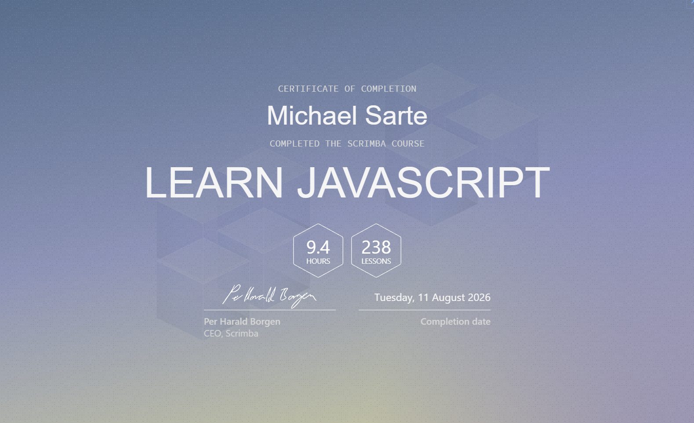

# JavaScript Solo Projects

This repository contains a collection of JavaScript projects that I completed while learning JavaScript and web development through Scrimba.

The projects were created from Scrimba project briefs, designs, challenges, and guided course sections. The goal was to practise solving problems, apply JavaScript concepts in complete applications, and gradually work more independently.

## Learning Focus

The projects focus on practical frontend development concepts, including:

- JavaScript fundamentals
- Variables, functions, and control structures
- Arrays, objects, and loops
- DOM manipulation
- Event handling
- Application logic
- HTML and CSS integration
- Building features from project requirements
- Browser APIs and Local Storage
- Firebase Realtime Database
- Mobile web application fundamentals
- Debugging and improving existing code
- Git and GitHub workflows

## Projects

Each project is stored in its own directory and contains the required HTML, CSS, JavaScript, and asset files.

```text
javascript-solo-projects/
├── Basketball Scoreboard/
├── BlackJack/
├── Browser Extension/
├── Mobile App/
├── PasswordGenerator/
├── Unit Converter/
└── assets/
```

The repository will be expanded as I complete additional JavaScript projects.

## Project Overview

| Project | Description | Main Learning Focus | Status |
| --- | --- | --- | --- |
| Basketball Scoreboard | A digital scoreboard for tracking the scores of two basketball teams. | DOM manipulation, functions, button events, and updating values | Completed |
| BlackJack | A simple Blackjack game with card generation and game-state logic. | Arrays, conditions, loops, functions, and random numbers | Completed |
| Password Generator | A random password generator with adjustable length, optional letters-only mode, and copy-to-clipboard functionality. | Event listeners, loops, arrays, user input, random values, and the Clipboard API | Completed |
| Chrome Leads Tracker Extension | A Chrome extension for saving and managing links, including the current browser tab, with persistent storage using Local Storage. | Chrome Extension API, Local Storage, DOM manipulation, event listeners, template literals, arrays, functions, and dynamic rendering | Completed |
| Unit Converter | A browser-based converter for length, volume, and mass between metric and imperial units. | Functions, user input, arithmetic operators, event handling, template literals, and DOM manipulation | Completed |
| Leads Tracker Mobile Web App | A mobile-friendly URL tracker with persistent cloud storage and real-time database updates. | Firebase Realtime Database, snapshots, objects and arrays, DOM rendering, ES modules, Web Application Manifest, and mobile web development | Completed |

## Running a Project

1. Open the directory of the project.
2. Follow the instructions in the project's own `README.md` file.

Most projects can be opened directly through their `index.html` file. Projects that require a development server or external service include the necessary information in their own documentation.

## Course Completion

I completed Scrimba's **Learn JavaScript** course on 11 August 2026 after working through 238 lessons and completing the accompanying exercises and projects.



The certificate documents my course completion. The projects in this repository demonstrate how I applied the covered concepts in practice.

## About Scrimba

The project requirements, visual designs, challenges, and learning material were provided through [Scrimba](https://scrimba.com/).

The application logic and implementations in this repository were completed by me as part of my personal learning process.

## Author

Michael Sarte

GitHub: [MkySarte](https://github.com/MkySarte)
